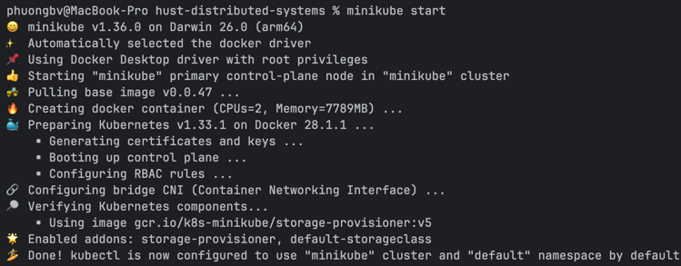
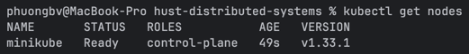
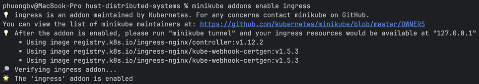
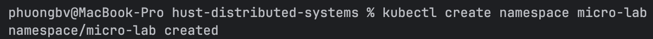
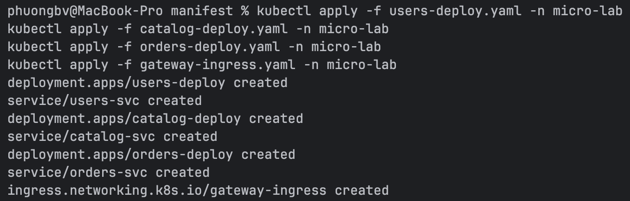
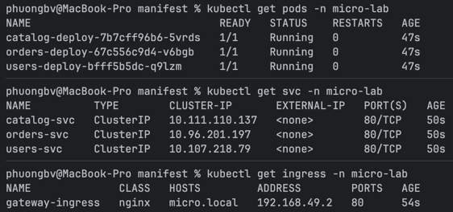
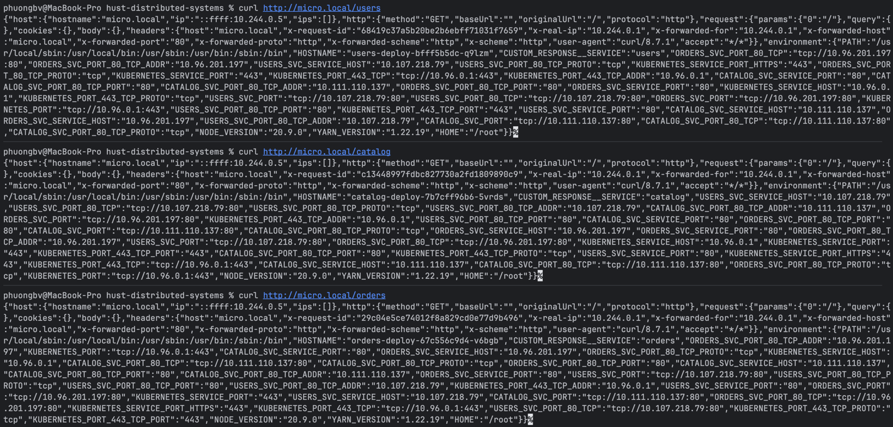
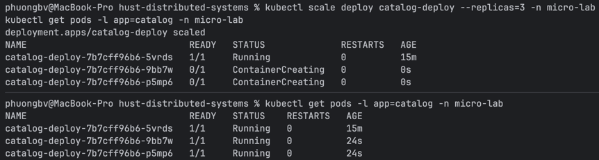
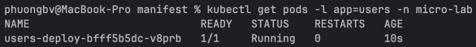

## Lab

```sh
minikube start
```



```sh
kubectl get nodes
```



```sh
minikube addons enable ingress
```



```sh
kubectl create namespace micro-lab
```



```sh
kubectl apply -f users-deploy.yaml -n micro-lab
kubectl apply -f catalog-deploy.yaml -n micro-lab
kubectl apply -f orders-deploy.yaml -n micro-lab
kubectl apply -f gateway-ingress.yaml -n micro-lab
```



```sh
kubectl get pods -n micro-lab
kubectl get svc -n micro-lab
kubectl get ingress -n micro-lab
```



```sh
minikube tunnel
```

```sh
sudo echo "\n127.0.0.1 micro.local" >> /etc/hosts
```

```sh
curl http://micro.local/users
curl http://micro.local/catalog
curl http://micro.local/orders
```



```sh
kubectl scale deploy catalog-deploy --replicas=3 -n micro-lab
kubectl get pods -l app=catalog -n micro-lab
```



```sh
kubectl delete namespace micro-lab
```

## Q&A

Câu hỏi 6: Sau khi chạy kubectl apply -f users-deploy.yaml, dùng lệnh nào
để kiểm tra Pod của service users đã chạy thành công? Hãy chụp màn hình kết
quả.

> kubectl get pods -l app=users -n micro-lab
> 

Câu hỏi 7: Trong file users-deploy.yaml, hãy chỉ ra:

- Deployment quản lý bao nhiêu replica ban đầu?
- Service thuộc loại nào (ClusterIP, NodePort, LoadBalancer)?

> pod replicas: 1,
> service type: ClusterIP

Câu hỏi 8: Sau khi cài Ingress, em cần thêm dòng nào vào file /etc/hosts để
truy cập bằng tên miền micro.local?

> ```
> 127.0.0.1     micro.local     # khi enable ingress addon
> 192.168.49.2  micro.local     # dùng minikube ip khi không enable ingress addon
> ```
