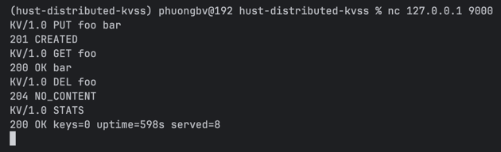
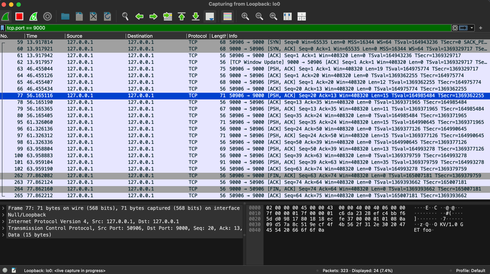

# HUST Mini Distributed KV Storage System

A minimal TCP key–value server implementing a simple line-based protocol, plus a tiny CLI client and a pytest test
suite.

## Prerequisites

- Python 3.11 or newer.

## Start the Server

The server script is at `server.py`.

- Default listen address when run directly: `0.0.0.0:9000`.
- You can pass `host` and `port` as command-line arguments.

Example:

```bash
# Run with defaults (0.0.0.0:9000)
python server.py

# Run on 127.0.0.1:9001
python server.py --host 127.0.0.1 --port 9001
```

To stop the server, press Ctrl+C or send a `QUIT` via the client (see below).

## Client Usage

```bash
python client.py [--host <host>] [--port <port>] <command> [args]
```

Supported commands:

- `get <key>` → `KV/1.0 GET <key>`
- `put <key> <value>` → `KV/1.0 PUT <key> <value>`
- `del <key>` → `KV/1.0 DEL <key>`
- `stats` → `KV/1.0 STATS`
- `quit` → `KV/1.0 QUIT`

Examples:

```bash
# Put a value (created → 201)
python client.py put foo bar
# -> 201 CREATED

# Update (existing → 200)
python client.py put foo baz
# -> 200 OK

# Get a value
python client.py get foo
# -> 200 OK baz

# Delete a key
python client.py del foo
# -> 204 NO_CONTENT

# Stats
python client.py stats
# -> 200 OK keys=<n> uptime=<s>s served=<m>

# Ask server to shutdown gracefully
python client.py quit
# -> 200 OK bye
```

## Run the Test Suite

```bash
# install uv if you don't have it yet
curl -LsSf https://astral.sh/uv/install.sh | sh
# then sync
uv sync
```

Run all tests:

```bash
uv run pytest
```

## Manual interaction with nc/telnet

Example with nc:

```bash
# By default the server listens on 0.0.0.0:9000
nc 127.0.0.1 9000

# After connecting, type one command per line and press Enter:
KV/1.0 PUT foo bar
# -> 201 CREATED

KV/1.0 GET foo
# -> 200 OK bar

KV/1.0 DEL foo
# -> 204 NO_CONTENT

KV/1.0 STATS
# -> 200 OK keys=<n> uptime=<s>s served=<m>

KV/1.0 QUIT
# -> 200 OK bye (server will shut down)
```

Example with telnet:

```bash
telnet 127.0.0.1 9000
# Once got "Connected to ...", enter commands as above.
```

## Wireshark: Observe TCP session

Test with `nc`:



Capture packets in one TCP session with Wireshark:


Link: [wireshark-record.pcapng](docs/wireshark-record.pcapng)

## Q&A

Câu hỏi 1: Interface trong hệ thống phân tán là gì? Tại sao cần phải có Interface khi
triển khai các dịch vụ?

> Interface đóng vai trò như "ngôn ngữ" hoặc "quy tắc" giao tiếp chung giữa các thành phần trong hệ thống phân tán.
> Nó định nghĩa cách mà các thành phần này tương tác với nhau.
> Xây dựng 1 hệ thống phân tán nhưng không có Interface thì không khác gì xây dựng 1 nhóm học tập mà mỗi người nói 1
> ngôn ngữ riêng, không ai hiểu ai.

Câu hỏi 2: Hãy giải thích ý nghĩa của mã trạng thái 201 CREATED, 204
NO_CONTENT và 404 NOT_FOUND trong giao thức KVSS.

> Ý nghĩa tương tự với HTTP code, trong đó:
>
> 201 CREATED: Thông báo rằng tài nguyên đã được khởi tạo theo yêu cầu
>
> 204 NO_CONTENT: Hành động đã thành công và không cần cung cấp thêm thông tin nào nữa
>
> 404 NOT_FOUND: Không tồn tại tài nguyên cần truy vấn

Câu hỏi 3: Trong bài lab KVSS, nếu client không tuân thủ quy ước Interface (ví dụ:
thiếu version KV/1.0), server sẽ phản hồi thế nào? Tại sao phải quy định rõ ràng tình
huống này?

> Server sẽ phản hồi với mã "426 UPGRADE_REQUIRED" với tình huống version không hợp lệ và "400 BAD_REQUEST" cho các
> trường hợp sai cú pháp khác.
> Phải quy định rõ ràng để cho client biết rằng mình đang bị sai quy tắc trong giao tiếp, cần tự nó sửa lại.

Câu hỏi 4: Quan sát một phiên làm việc qua Wireshark: hãy mô tả cách mà gói tin
TCP được chia để truyền thông điệp theo "line-based protocol".

> Bắt đầu 1 phiên:
> - client → server gói tin `SYN` ~ bắt đầu handshake
> - server → client gói tin `[SYN, ACK]`
>
> Các gói tin ở giữa:
> - Với "line-based protocol", mỗi thông điệp kết thúc bằng ký tự newline (LF).
>
> Kết thúc phiên:
> - client → server gói tin `[FIN, ACK]`
> - server → client gói tin `ACK` và `[FIN, ACK]`
> - client → server gói tin `ACK`

Câu hỏi 5: Giả sử có một client viết sai giao thức (gửi KV/1.0 POTT user42
Alice). Server sẽ xử lý như thế nào? Kết quả này thể hiện đặc điểm gì của Interface?

> Server sẽ phản hồi "400 BAD_REQUEST" vì lệnh "POTT" không thuộc tập lệnh hợp lệ.
> Kết quả này thể hiện tính chặt chẽ và khả năng cưỡng chế hợp đồng (contract enforcement) của Interface:
> server chỉ chấp nhận cú pháp/command đúng đặc tả và fail-fast khi gặp sai lệch, giúp phản hồi lỗi tới client sớm.
