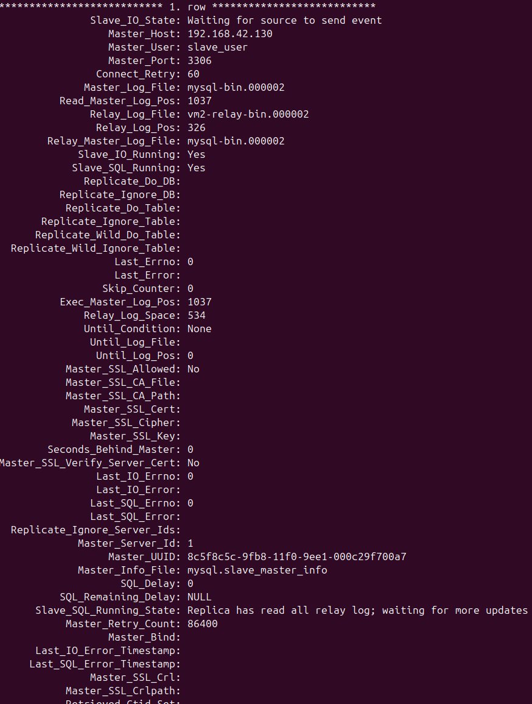

## Setup

### Install on 2 VM

```shell
sudo apt install openssh-server -y
sudo service ssh enable
sudo service ssh start
sudo service ssh status
```

```shell
sudo apt-get install mysql-server mysql-client -y
```

```shell
sudo mysql
```

````sh
ALTER USER 'root'@'localhost' IDENTIFIED WITH caching_sha2_password BY '1';
FLUSH PRIVILEGES;
EXIT;
````

### Config on Master VM

Use a single command to auto-detect the master VM's IP address and write the configuration to /etc/mysql/my.cnf:

```sh
MASTER_IP=$(ip route get 1 | awk '{print $7; exit}')

sudo sh -c "cat > /etc/mysql/my.cnf <<EOF
[mysqld]
bind-address = $MASTER_IP
server-id = 1
log_bin = /var/log/mysql/mysql-bin.log
binlog_do_db = petdatabase
local_infile=1
EOF"
```

```sh
sudo service mysql restart
```

Copy [pet.txt](pet.txt) into `/tmp/pet.txt`

```sh
mysql -u root -p --local-infile=1
```

```sh
CREATE USER 'slave_user'@'%' IDENTIFIED WITH mysql_native_password BY '1';
GRANT REPLICATION SLAVE ON *.* TO 'slave_user'@'%';
FLUSH PRIVILEGES;
CREATE DATABASE petdatabase;
USE petdatabase;
CREATE TABLE pet (name VARCHAR(20), owner VARCHAR(20), species VARCHAR(20), sex CHAR(1), birth DATE, death DATE);
SHOW TABLES;
DESCRIBE pet;
LOAD DATA LOCAL INFILE '/tmp/pet.txt' INTO TABLE pet;
SELECT * FROM pet;
# Wait for Question 1
FLUSH TABLES WITH READ LOCK;
SHOW MASTER STATUS;
# Wait for Question 2
EXIT;
```

Export the database file:

```sh
mysqldump -u root -p --opt petdatabase > petdatabase.sql
```

Send dump to the slave machine:

```sh
scp petdatabase.sql user@192.168.42.131:.
# Wait for Question 3
```

### Config on Slave VM

```sh
mysql -u root -p
```

```sh
CREATE DATABASE petdatabase;
EXIT;
```

```sh
mysql -u root -p petdatabase < ~/petdatabase.sql
```

```sh
SLAVE_IP=$(ip route get 1 | awk '{print $7; exit}')

sudo sh -c "cat > /etc/mysql/my.cnf <<EOF
[mysqld]
bind-address = $SLAVE_IP
server-id = 2
log_bin = /var/log/mysql/mysql-bin.log
binlog_do_db = petdatabase
local_infile=1
EOF"
```

```sh
sudo service mysql restart
```

Realize the replication:

```sh
mysql -u root -p
```

```sh
CHANGE MASTER TO MASTER_HOST='192.168.42.130',MASTER_USER='slave_user',MASTER_PASSWORD='1',MASTER_LOG_FILE='mysql-bin.000002',MASTER_LOG_POS=1037;
START SLAVE;
SHOW SLAVE STATUS\G
# Wait for Question 4
```

### Test the replication

Now, you can return to the shell window on the Master machine that you left it blocked. Type:

```sh
UNLOCK TABLES;
```

Try to insert new data to database petdatabase:

```sh
USE petdatabase;
INSERT INTO pet VALUES('Puffball','Diane','hamster','f','1999-03-30',NULL);
# Wait for Question 5
```

## Q&A

Question 1: What is the output did you see? Now, try to add another entry to the
table pet in using SQL queries.

> 


Question 2: What is the name of the log file and the position?

> mysql-bin.000002 | 1037
>
> 

Question 3: Have you received this file in Slave machine? What is the path of this
received file in the Slave machine?

> Yes
> 
> 
>
> ~/petdatabase.sql
> 
> 

Question 4: What is the status information you received? How do you know the
configuration is OK?

> Slave_SQL_Running_State: Replica has read all relay log; waiting for more updates
> 
> 

Question 5: In the Slave machine, verify if the new inserted data has been
replicated from Master to Slave. Which command did you use?

> USE petdatabase;
> 
> SELECT * FROM pet;
> 
> 