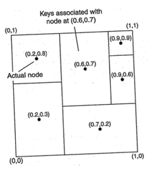

# Chapter 1 Theory

Câu hỏi 1: Em hãy nêu thêm 2 ví dụ về dịch vụ được coi là Hệ Phân Tán (ngoài 2 ví dụ
WWW và Email đã trình bày trên lớp). Dựa vào định nghĩa, giải thích tại sao chúng được
coi là Hệ Phân Tán.

> - AWS S3: dữ liệu được chia nhỏ và sao chép trên nhiều node → AZ → region, truy cập qua API thống nhất, đáp ứng định
    nghĩa "nhiều máy tính độc lập hiện ra như một hệ thống duy nhất".
> - Cloudflare CDN: nhiều edge servers đặt rải rác địa lý, định tuyến yêu cầu tới nút gần nhất, có cơ chế đồng bộ/ghi đè
    cache, tập hợp các nodes độc lập để cung cấp dịch vụ thống nhất, minh họa rõ tính minh bạch vị trí và mở rộng.

Câu hỏi 2: Tại sao nói tính chia sẻ tài nguyên của Hệ Phân Tán có khả năng: Giảm chi phí,
tăng tính sẵn sàng và hỗ trợ làm việc nhóm? Tuy nhiên lại tăng rủi ro về an toàn thông tin?
Giải thích.

> - Giảm chi phí: tái sử dụng tài nguyên chung (máy chủ, dữ liệu, giấy phép), tận dụng co-location, tối ưu sử dụng nhờ
    cân bằng tải.
> - Tăng tính sẵn sàng: tài nguyên nhân bản trên nhiều node/region; khi một node down, node khác có thể thay thế ngay (
    replication, failover, quorum).
> - Hỗ trợ làm việc nhóm: mỗi dịch vụ trong hệ thống có thể được phát triển bảo trì một cách độc lập, tập trung hơn bởi
    các team khác nhau.
> - Tăng rủi ro ATTT: bề mặt tấn công rộng (nhiều node, nhiều đường mạng, nhiều API); chia sẻ dẫn tới yêu cầu kiểm soát
    truy cập phức tạp (nhầm cấu hình gây lộ dữ liệu); luồng dữ liệu đi qua mạng có nguy cơ bị can thiệp, tấn công; phụ
    thuộc lẫn nhau tạo chuỗi tấn công; dữ liệu sao chép nhiều nơi khó quản trị vòng đời và tuân thủ.

Câu hỏi 3: Liên quan đến tính trong suốt, giải thích tại sao nhà quản trị hệ thống phải xem
xét việc cân bằng giữa hiệu năng và độ trong suốt? Đưa ra ví dụ cụ thể để giải thích.

> Ví dụ 1 cụm PostgreSQL DB có 3 nodes, 1 master, 2 replica đặt ở 3 vùng địa lý khác nhau
> - Khi ứng dụng gửi yêu cầu read, thì sẽ gửi tới 1 LoadBalancer để tự điều phối tới 1 trong 3 node
> - Vấn đề ở đây là yêu cầu có thể bị điều phối đi tới 1 node ở xa → high latency ~ hiệu năng kém, đổi lại thì client
    chỉ cần tương tác với 1 LoadBalancer ~ trong suốt
> - Để giảm latency ~ tăng performance thì cách tốt nhất là chỉ định 1 node ở gần client nhất → client phải tương tác
    với 1 node cụ thể, làm giảm tính trong suốt

Câu hỏi 4: Trong mô hình kiến trúc phân tầng OSI của Mạng máy tính, hãy trình bày tóm
tắt chức năng của từng tầng. Lấy ví dụ cụ thể khi chúng ta thay đổi/cập nhật một tầng bất
kỳ thì không ảnh hưởng đến hoạt động của các tầng khác.

> - Tầng 7 Ứng dụng: giao thức ứng dụng (HTTP, FTP, SMTP…).
> - Tầng 6 Trình bày: mã hóa/giải mã, nén, chuyển đổi biểu diễn.
> - Tầng 5 Phiên: thiết lập/duy trì/đồng bộ phiên trao đổi.
> - Tầng 4 Giao vận: đầu-cuối, tin cậy (TCP) hoặc không tin cậy (UDP), điều khiển tắc nghẽn.
> - Tầng 3 Mạng: định tuyến gói giữa liên mạng (IP), địa chỉ logic.
> - Tầng 2 Liên kết dữ liệu: khung, địa chỉ MAC, phát hiện/sửa lỗi cục bộ, truy nhập môi trường (Ethernet, Wi‑Fi).
> - Tầng 1 Vật lý: tín hiệu điện/quang/vô tuyến, tốc độ bit, đầu nối.
> - Ví dụ thay đổi: nâng cấp từ 4G lên 5G (tầng 1/2) không làm ứng dụng HTTP cần sửa mã; hoặc thay đổi thuật toán định
    tuyến ở tầng 3 không yêu cầu thay đổi ở lớp ứng dụng.

Câu hỏi 5: Cho ví dụ và phân tích một mô hình kiến trúc thuê bao/xuất bản (publish/subscribe).

> - Ví dụ: Kafka. Publisher gửi thông điệp vào topic; subscriber đăng ký nhận theo
    topic; broker chịu trách nhiệm phân phối, lưu giữ, cân bằng và mở rộng ngang.
> - Phân tích: tách biệt nhà sản xuất-tiêu thụ, giảm kết dính, dễ mở rộng nhiều consumer. Nhược: độ trễ phụ thêm qua
    broker, đảm bảo thứ tự/nhất quán khó, cần quản trị phân vùng/offset và bảo mật truy cập theo topic.

Câu hỏi 6: Phân tích ưu nhược điểm của kiến trúc tập trung và kiến trúc không tập trung.

> Tập trung (centralized):
> - Ưu: đơn giản quản trị, nhất quán dễ đảm bảo, quan sát/kiểm soát tốt, chi phí đầu tư ban đầu thấp.
> - Nhược: điểm đơn hỏng (SPOF), giới hạn mở rộng theo chiều dọc, tắc nghẽn/nút cổ chai, rủi ro bảo mật cao nếu bị chiếm
    quyền.
>
> Không tập trung (decentralized/distributed/peer-to-peer):
> - Ưu: chịu lỗi tốt, mở rộng ngang, tận dụng tài nguyên rải rác, giảm độ trễ nhờ gần dữ liệu/người dùng.
> - Nhược: phức tạp điều phối/nhất quán (CAP), quan sát khó, lỗi từng phần, thuật toán đồng thuận/định tuyến phức tạp,
    chi phí vận hành phân tán.

Câu hỏi 7: Xét một chuỗi các tiến trình P1, P2, ..., Pn triển khai một kiến trúc client-server
đa tầng. Cơ chế hoạt động của tổ chức đó như sau: tiến trình Pi là client của tiến trình Pi+1,
và Pi sẽ trả lời Pi-1 chỉ khi đã nhận được câu trả lời từ Pi+1.
Vậy những vấn đề nào sẽ nảy sinh với tổ chức này khi xem xét hiệu năng yêu cầu-trả lời
tới P1?

> - Độ trễ tích lũy tuyến tính theo số tầng (n lần round-trip) -> P1 có thời gian đáp ứng kém.
> - Độ sẵn sàng giảm: bất kỳ Pi+1 chậm/hỏng làm toàn chuỗi treo (SPOF theo chuỗi).
> - Bùng nổ tải: mỗi tầng thêm hàng đợi, dễ tạo hiệu ứng domino, độ trễ đuôi (tail latency) tăng.
> - Khó mở rộng: cần scale đồng bộ theo chuỗi để tránh nút cổ chai; liên tầng tăng chi phí mạng.
> - Truy vết/quan sát khó: cần distributed tracing để tìm nút chậm.

Câu hỏi 8: Xét mạng CAN như trong hình. Giả sử tất cả các node đều biết node hàng xóm
của mình. Một giải thuật định tuyến được đưa ra đó là gửi các gói tin cho node hàng xóm
gần mình nhất và hướng đến đích. Giải thuật này có tốt không? Giải thích.

> - Đây là giải thuật "greedy routing" theo khoảng cách đến đích.
> - Không tối ưu/tin cậy nói chung: có thể kẹt tại "điểm kẹt cục bộ" (local minima) nơi mọi hàng xóm đều xa đích
    hơn (không tới được dù có đường), không đảm bảo đường đi ngắn nhất, có thể vòng lặp nếu không kiểm soát.